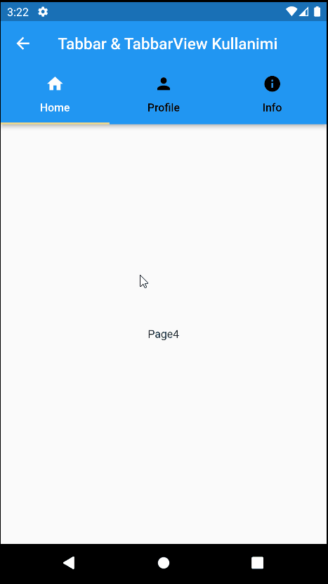

## Flutter Tekrar Calismalarim

#### TextFiled - Controller - FocusNode Kullanimi

#### TextFormField Kullanimi

#### Stepper Kullanimi

####  Drawer ve Inkwell Kullanimi

#### Bottom Navigation Bar Kullanimi

#### ExpansionTile Kullanimi

#### PageView Kullanimi

#### Tabbar & TabbarView Kullanimi

